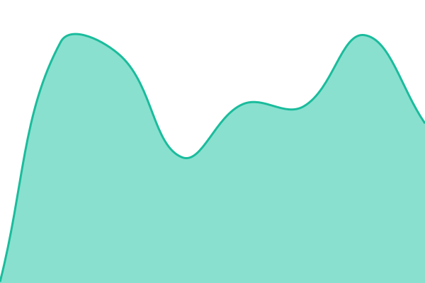
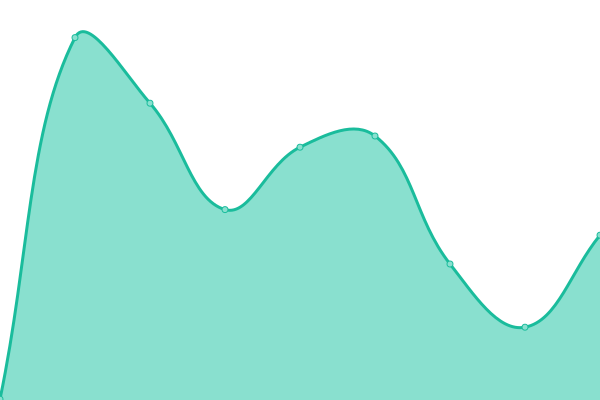
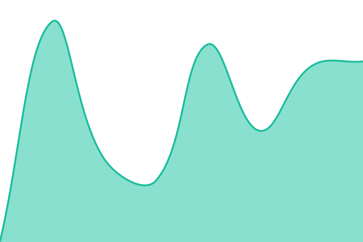
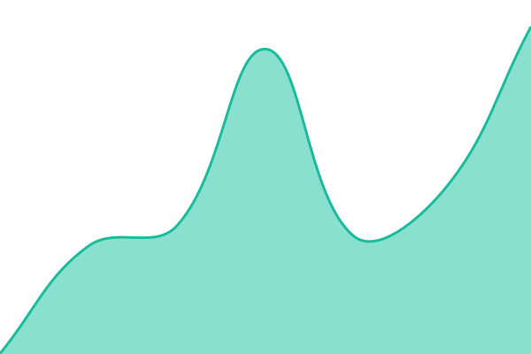
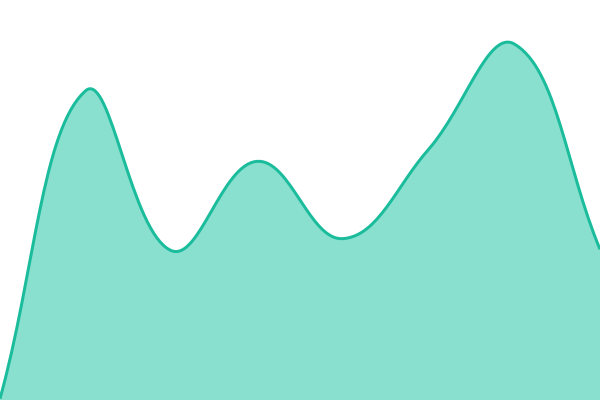
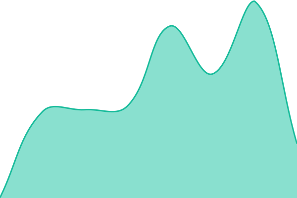

# [📈 Live Status](https://RapidataAI.github.io/upptime): <!--live status--> **🟧 Partial outage**

This repository contains the open-source uptime monitor and status page for [RapidataAI](https://RapidataAI.github.io/upptime), powered by [Upptime](https://github.com/upptime/upptime).

With [Upptime](https://upptime.js.org), you can get your own unlimited and free uptime monitor and status page, powered entirely by a GitHub repository. We use [Issues](https://github.com/RapidataAI/upptime/issues) as incident reports, [Actions](https://github.com/RapidataAI/upptime/actions) as uptime monitors, and [Pages](https://RapidataAI.github.io/upptime) for the status page.

<!--start: status pages-->
<!-- This summary is generated by Upptime (https://github.com/upptime/upptime) -->
<!-- Do not edit this manually, your changes will be overwritten -->
<!-- prettier-ignore -->
| URL | Status | History | Response Time | Uptime |
| --- | ------ | ------- | ------------- | ------ |
|  [Website AI](https://www.rapidata.ai) | 🟩 Up | [website-ai.yml](https://github.com/RapidataAI/upptime/commits/HEAD/history/website-ai.yml) | 

 208ms
     
 | 

<a href="https://rapidataai.github.io/upptime/history/website-ai">100.00%</a>
    

|  [Website IO](https://www.rapidata.io) | 🟥 Down | [website-io.yml](https://github.com/RapidataAI/upptime/commits/HEAD/history/website-io.yml) | 

 86ms
     
 | 

<a href="https://rapidataai.github.io/upptime/history/website-io">0.00%</a>
    

|  [APP AI](https://app.rapidata.ai) | 🟩 Up | [app-ai.yml](https://github.com/RapidataAI/upptime/commits/HEAD/history/app-ai.yml) | 

 132ms
     
 | 

<a href="https://rapidataai.github.io/upptime/history/app-ai">100.00%</a>
    

|  [APP IO](https://app.rapidata.io) | 🟩 Up | [app-io.yml](https://github.com/RapidataAI/upptime/commits/HEAD/history/app-io.yml) | 

 225ms
     
 | 

<a href="https://rapidataai.github.io/upptime/history/app-io">100.00%</a>
    

|  [Documentation](https://docs.rapidata.ai) | 🟩 Up | [documentation.yml](https://github.com/RapidataAI/upptime/commits/HEAD/history/documentation.yml) | 

 141ms
     
 | 

<a href="https://rapidataai.github.io/upptime/history/documentation">100.00%</a>
    

|  [Assets](https://assets.rapidata.ai) | 🟥 Down | [assets.yml](https://github.com/RapidataAI/upptime/commits/HEAD/history/assets.yml) | 

 46ms
     
 | 

<a href="https://rapidataai.github.io/upptime/history/assets">0.00%</a>
    

|  [Rapids Frontend](https://rapids.rapidata.ai/rapid) | 🟩 Up | [rapids-frontend.yml](https://github.com/RapidataAI/upptime/commits/HEAD/history/rapids-frontend.yml) | 

 340ms
     
 | 

<a href="https://rapidataai.github.io/upptime/history/rapids-frontend">100.00%</a>
    

|  [Rapids Frontend (RPDT)](https://rapids.rpdt.net/rapid) | 🟩 Up | [rapids-frontend-rpdt.yml](https://github.com/RapidataAI/upptime/commits/HEAD/history/rapids-frontend-rpdt.yml) | 

 215ms
     
 | 

<a href="https://rapidataai.github.io/upptime/history/rapids-frontend-rpdt">100.00%</a>
    

|  [Rapid Service](https://api.rpdt.net/Rapid/health) | 🟩 Up | [rapid-service.yml](https://github.com/RapidataAI/upptime/commits/HEAD/history/rapid-service.yml) | 

 237ms
     
 | 

<a href="https://rapidataai.github.io/upptime/history/rapid-service">100.00%</a>
    

|  [Session Service](https://api.rpdt.net/Session/health) | 🟩 Up | [session-service.yml](https://github.com/RapidataAI/upptime/commits/HEAD/history/session-service.yml) | 

 218ms
     
 | 

<a href="https://rapidataai.github.io/upptime/history/session-service">100.00%</a>
    

|  [Workflow Service](https://api.rapidata.ai/Workflow/health) | 🟩 Up | [workflow-service.yml](https://github.com/RapidataAI/upptime/commits/HEAD/history/workflow-service.yml) | 

 212ms
     
 | 

<a href="https://rapidataai.github.io/upptime/history/workflow-service">100.00%</a>
    

|  [Identity Service](https://api.rapidata.ai/Identity/health) | 🟩 Up | [identity-service.yml](https://github.com/RapidataAI/upptime/commits/HEAD/history/identity-service.yml) | 

 191ms
     
 | 

<a href="https://rapidataai.github.io/upptime/history/identity-service">100.00%</a>
    

|  [Order Service](https://api.rapidata.ai/Order/health) | 🟩 Up | [order-service.yml](https://github.com/RapidataAI/upptime/commits/HEAD/history/order-service.yml) | 

 197ms
     
 | 

<a href="https://rapidataai.github.io/upptime/history/order-service">100.00%</a>
    

|  [Payment Service](https://api.rapidata.ai/Payment/health) | 🟩 Up | [payment-service.yml](https://github.com/RapidataAI/upptime/commits/HEAD/history/payment-service.yml) | 

 202ms
     
 | 

<a href="https://rapidataai.github.io/upptime/history/payment-service">100.00%</a>
    

|  [Campaign Service](https://api.rapidata.ai/Campaign/health) | 🟩 Up | [campaign-service.yml](https://github.com/RapidataAI/upptime/commits/HEAD/history/campaign-service.yml) | 

 181ms
     
 | 

<a href="https://rapidataai.github.io/upptime/history/campaign-service">100.00%</a>
    

|  [Admin Service](https://api.rapidata.ai/Admin/health) | 🟩 Up | [admin-service.yml](https://github.com/RapidataAI/upptime/commits/HEAD/history/admin-service.yml) | 

 200ms
     
 | 

<a href="https://rapidataai.github.io/upptime/history/admin-service">100.00%</a>
    

|  [Dataset Service](https://api.rapidata.ai/Dataset/health) | 🟩 Up | [dataset-service.yml](https://github.com/RapidataAI/upptime/commits/HEAD/history/dataset-service.yml) | 

 181ms
     
 | 

<a href="https://rapidataai.github.io/upptime/history/dataset-service">100.00%</a>
    

|  [Pipeline Service](https://api.rapidata.ai/Pipeline/health) | 🟩 Up | [pipeline-service.yml](https://github.com/RapidataAI/upptime/commits/HEAD/history/pipeline-service.yml) | 

 184ms
     
 | 

<a href="https://rapidataai.github.io/upptime/history/pipeline-service">100.00%</a>
    

|  [Validation Service](https://api.rapidata.ai/Validation/health) | 🟩 Up | [validation-service.yml](https://github.com/RapidataAI/upptime/commits/HEAD/history/validation-service.yml) | 

 180ms
     
 | 

<a href="https://rapidataai.github.io/upptime/history/validation-service">100.00%</a>
    

|  [Campaign Monitor](https://api.rapidata.ai/Campaign/Monitor) | 🟩 Up | [campaign-monitor.yml](https://github.com/RapidataAI/upptime/commits/HEAD/history/campaign-monitor.yml) | 

 227ms
     
 | 

<a href="https://rapidataai.github.io/upptime/history/campaign-monitor">100.00%</a>
    

<!--end: status pages-->

[**Visit our status website →**](https://RapidataAI.github.io/upptime)

## 📄 License

- Powered by: [Upptime](https://github.com/upptime/upptime)
- Code: [MIT](./LICENSE) © [Anand Chowdhary](https://anandchowdhary.com), supported by [Pabio](https://pabio.com)
- Data in the `./history` directory: [Open Database License](https://opendatacommons.org/licenses/odbl/1-0/)
